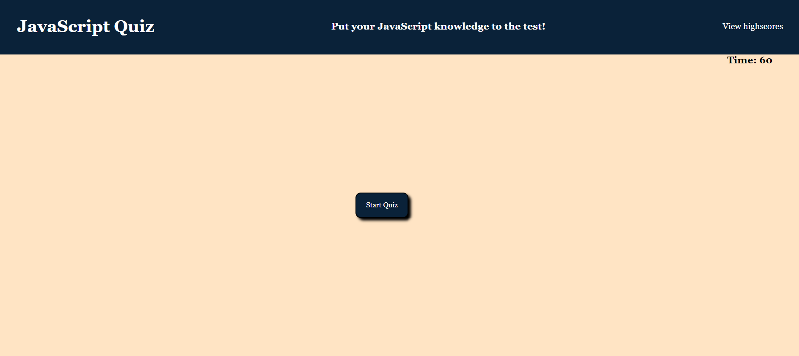
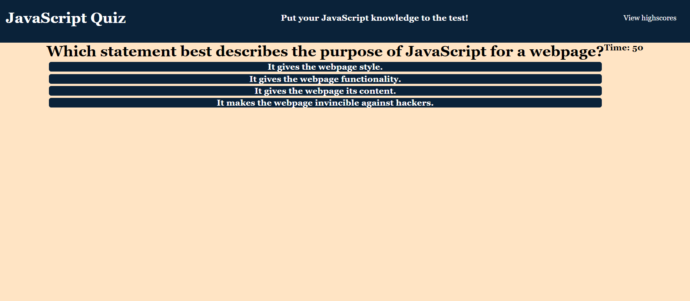

# JavaScript Quiz

## Link to deployed website: https://wasmunlb.github.io/js-quiz

## Description

For this assignment, I created a simple quiz that tests the user's knowledge of JavaScript. It consists of five questions, all of which are multiple-choice questions. It also allows the user to save their high scores.

I learned lots from this assignment. Mainly how to create a dynamic webpage using JS DOM methods. My JavaScript is far from efficient and is not very maintainable. If I were to start this assignment again from scratch, I would make an array to hold all of the questions and use a single function to create the question pages. This would make it easier to add more questions to the quiz in the future.

## Usage

Using this website is very simple. All the user needs to do is press the start button and answer the questions before the time runs out. The user will be awarded 10 points for each correct question that is answered. Additionally, the user will lose 10 seconds from the timer for each question that is answered incorrectly. Attached are screenshots of the website.

## License

The MIT License was used for this assignment.

